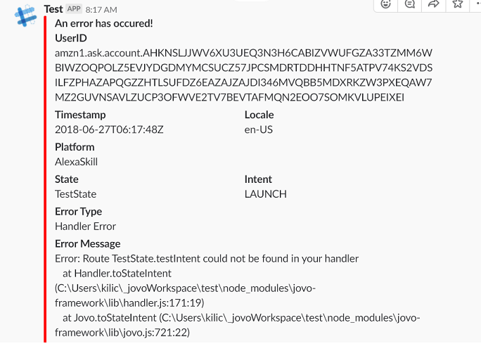

# Installation
```sh
$ npm install jovo-plugin-slack-error-log --save
```

In your Jovo project:
```javascript
const SlackError = require('jovo-plugin-slack-error-log');

let options = {
    webhookURL: 'yourSlackWebhookURL'
}

app.register('SlackError', new SlackError(options));
```
To create enable incoming webhooks for your Slack follow this [guide](https://api.slack.com/incoming-webhooks).

# Customize
NOTE: The webhookURL is a **required** parameter

The plugin sends the error message as an [attachement](https://api.slack.com/docs/message-attachments). Every parameter is customizable except the `ts` parameter.

You can use the `options` parameter to add the changes in the following format:
```javascript
let options = {
    webhookURL: '',
    channel: '',
    fallback: '',
    color: '',
    pretext: '', 
    author_name: '',
    author_link: '',
    author_icon: '',
    title: '',
    title_link: '',
    text: '',
    image_url: '',
    thumb_url: '',
    footer: '',
    footer_icon: '',
}
```
If you don't customize anything, these default values will be used:
```javascript
let options = {
    channel: 'Channel you specified on your webhook\'s settings',
    fallback: 'Error Message',
    color: '#ff0000',
    title: 'An error has occured!',
    footer: 'Jovo Plugin - Slack Error',
    footer_icon: jovoLogo
}
```
Checkout the official documentation for more information on each parameter: [Docs](https://api.slack.com/docs/message-attachments)

You can also override the channel/user the message should be sent to: 
```javascript
let options = {
    channel : '#channel-name / @user-name';
}
```



# License

MIT